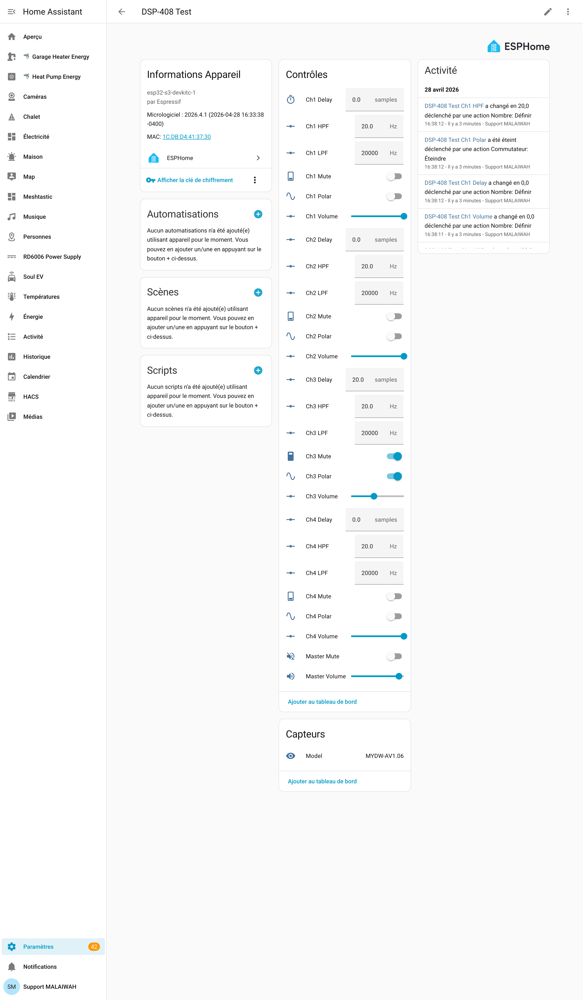
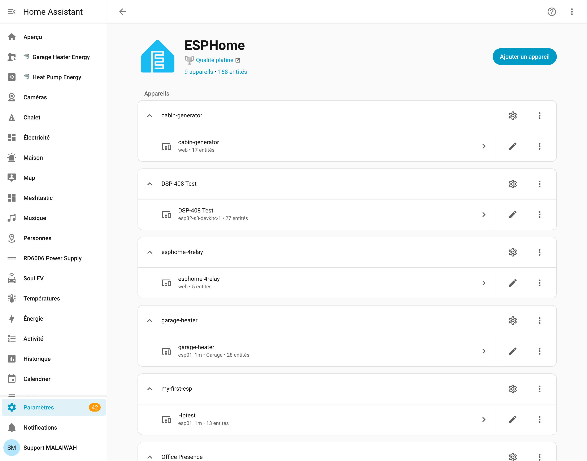

# dsp408-esphome

ESPHome external_component that talks to a Dayton Audio **DSP-408** directly
from an **ESP32-S3**'s native USB host peripheral. Plug the DSP-408 into the
ESP32-S3's USB-OTG port and the device shows up in Home Assistant as a
proper integration with sliders, switches and read-back state — no MQTT
glue, no USBIP, no Linux client, no kernel HID layer in the path.

<p align="center">
  
</p>

> *Above: the auto-generated device page Home Assistant builds from the
> ESPHome native API surface. Per-channel volume, mute, polar, delay,
> HPF/LPF for channels 1–4, master volume + mute, and the firmware
> identity sensor — all live, all bidirectional.*

## Status

**v0.2 — beta** (2026-04-28). Validated on an ESP32-S3 DevKitC-1 + a real
DSP-408 (firmware `MYDW-AV1.06`), driven from a live Home Assistant
instance over WiFi.

| Entity                     | Type          | Range / Notes                                        |
| -------------------------- | ------------- | ---------------------------------------------------- |
| Model identity             | `text_sensor` | `MYDW-AV1.06` on stock fw                            |
| Master volume              | `number`      | -60..+6 dB, 1 dB step                                |
| Master mute                | `switch`      | off=audible, on=muted                                |
| Channel volume × 8         | `number`      | -60..0 dB, 1 dB step                                 |
| Channel mute × 8           | `switch`      | per-output mute                                      |
| Channel polar × 8          | `switch`      | 180° phase invert                                    |
| Channel delay × 8          | `number`      | 0..359 samples (≈ 8.143 ms @ 44.1 kHz)               |
| Channel HPF cutoff × 8     | `number`      | 10..20000 Hz                                         |
| Channel LPF cutoff × 8     | `number`      | 100..22000 Hz                                        |

On connect, the bridge reads each channel's full 296-byte state blob
(via the multi-frame `cmd=0x77NN` path, with read-divergence retry up
to 4 attempts) and populates entities from device truth. Writes are
gated on warmup completion + cache-primed status to prevent the
"fresh-boot HA touch surges channel to 0 dB" hazard.

### Roadmap to v0.3

Tracked in [`docs/peer-review-2026-04-28.md`](docs/peer-review-2026-04-28.md):

- HPF/LPF filter type + slope as `select` entities
- 10-band parametric EQ (per-channel × per-band)
- Output routing matrix (4 inputs × 8 outputs)
- Preset name + per-channel name read/write
- Multi-frame WRITE for `set_full_channel_state` / preset save
- Compressor / dynamics (firmware-inert in v1.06 — low priority)
- Input-side processing (cat=0x03 plane)

## Hardware

- **ESP32-S3** with native USB peripheral exposed (DevKitC-1, ESP32-S3-Box,
  custom board). The ESP32-S3's USB pins are GPIO19 (D-) and GPIO20 (D+);
  these are dedicated and not remappable.
- **Dayton Audio DSP-408** (VID `0x0483`, PID `0x5750`) connected to the
  ESP32-S3's USB-OTG port. The DSP-408 is bus-powered; the host port must
  supply 5V. The standard DevKitC-1 does **not** supply 5V on the OTG jack
  by default — wire VBUS externally or use a powered USB-A breakout.
- **Console**: the ESP32-S3 has two USB peripherals sharing the same
  internal PHY. ESPHome's USB host stack needs the PHY in host mode, which
  conflicts with the boot-ROM USB-CDC console. Logs go out **UART0**
  (the on-board CP2102/CH340 bridge on the DevKitC-1's other USB-C jack).

## Usage

```yaml
external_components:
  - source: github://malaiwah/dsp408-esphome

esp32:
  board: esp32-s3-devkitc-1
  variant: esp32s3
  framework:
    type: esp-idf
    sdkconfig_options:
      CONFIG_ESP_CONSOLE_UART_DEFAULT: y
      CONFIG_ESP_CONSOLE_USB_SERIAL_JTAG: n
      CONFIG_ESP_CONSOLE_USB_CDC: n

usb_host:

dsp408:
  id: my_dsp

text_sensor:
  - platform: dsp408
    dsp408_id: my_dsp
    kind: MODEL
    name: "DSP-408 Model"

number:
  - platform: dsp408
    dsp408_id: my_dsp
    kind: MASTER_VOLUME
    name: "Master Volume"
  - platform: dsp408
    dsp408_id: my_dsp
    kind: CHANNEL_VOLUME
    channel: 0
    name: "Ch1 Volume"
  - platform: dsp408
    dsp408_id: my_dsp
    kind: CHANNEL_DELAY
    channel: 0
    name: "Ch1 Delay"
  - platform: dsp408
    dsp408_id: my_dsp
    kind: CHANNEL_HPF_FREQ
    channel: 0
    name: "Ch1 HPF"
  - platform: dsp408
    dsp408_id: my_dsp
    kind: CHANNEL_LPF_FREQ
    channel: 0
    name: "Ch1 LPF"

switch:
  - platform: dsp408
    dsp408_id: my_dsp
    kind: MASTER_MUTE
    name: "Master Mute"
  - platform: dsp408
    dsp408_id: my_dsp
    kind: CHANNEL_MUTE
    channel: 0
    name: "Ch1 Mute"
  - platform: dsp408
    dsp408_id: my_dsp
    kind: CHANNEL_POLAR
    channel: 0
    name: "Ch1 Polar"
```

See [`examples/dsp408-test.yaml`](examples/dsp408-test.yaml) for a fully-
populated config (4 channels with all six per-channel controls) and
[`examples/dsp408-test-minimal.yaml`](examples/dsp408-test-minimal.yaml)
for a no-network bench-test variant.

### Adopting in Home Assistant

ESPHome devices auto-discover via mDNS. After flashing, the DSP-408 shows
up under **Settings → Devices & Services → Discovered**. Click "Configure",
paste the API encryption key from your `secrets.yaml`, and HA will
register all entities automatically.

<p align="center">
  
</p>

## Architecture

```
   HA / MQTT
      │
   API/OTA (WiFi)
      │
┌─────┴────────┐
│ ESPHome      │   esp32-s3
│  ┌─────────┐ │
│  │ entities│◄┼── number / switch / text_sensor
│  └────┬────┘ │
│       │      │   in-process function calls (main loop task)
│  ┌────▼────┐ │
│  │ DSP408  │◄┼── parses frames, drives state machine,
│  └────┬────┘ │   reads each channel on connect (with retry)
│       │      │
│  ┌────▼────┐ │   esphome::usb_host::USBClient
│  │usb_host │ │   non-blocking transfer_in / transfer_out
│  └────┬────┘ │   lock-free queue → main loop, USB task at prio 5
└───────┼──────┘
        │ EP 0x01 OUT (interrupt, 64-byte HID reports)
        │ EP 0x82 IN  (interrupt, 64-byte HID reports)
        │
   ┌────▼─────┐
   │ DSP-408  │
   └──────────┘
```

The threading model is inherited from ESPHome's `usb_host` component:
a high-priority FreeRTOS task pumps `usb_host_lib_handle_events`, transfer
callbacks fire on that task, and a lock-free SPSC queue carries inbound
HID reports to the main loop where parsing and entity updates run.
Outbound `transfer_out` is non-blocking and safe to call directly from
entity `control()` handlers on the main loop.

## Provenance

The wire-format port is line-for-line traceable to
[**dsp408-py**](https://github.com/malaiwah/dsp408-py) (also at
[gitea](http://10.15.0.6:3300/malaiwah/dsp408-py)) — same 64-byte HID
frame layout, same XOR checksum, same command codes, same blob offsets,
same field semantics. dsp408-py did the heavy lifting of reverse-
engineering the device against the Windows GUI captures; this project
just turns that knowledge into ESP32 firmware.

If you're starting from scratch and want to understand **why** any
particular byte means what it means, read dsp408-py first. Especially:

- [`dsp408/protocol.py`](https://github.com/malaiwah/dsp408-py/blob/main/dsp408/protocol.py)
  — frame definition, command codes, blob layout. Many docstrings
  reference the original Windows captures byte-for-byte.
- [`dsp408/device.py`](https://github.com/malaiwah/dsp408-py/blob/main/dsp408/device.py)
  — high-level Device class. Lots of "this firmware does X if you
  Y" calibration notes from live testing on hardware.

The `docs/peer-review-2026-04-28.md` file in this repo has a full
feature-parity matrix vs dsp408-py, plus what's deferred to v0.3.

## Building + flashing

Initial flash (USB):

```bash
cd examples
esphome run dsp408-test.yaml --device /dev/cu.usbserial-XXX
```

Subsequent flashes go over WiFi via OTA — ESPHome handles this
automatically when you re-run `esphome run` and pass the device's
`*.local` hostname.

For dev iterations on the components directory itself, the YAML uses
`source: type: local, path: ../components` so edits to `components/dsp408/*`
are picked up by the next `esphome run`.

## Testing

Host-side unit tests cover the protocol layer (frame build/parse,
checksum, multi-frame parsing, payload encoders):

```bash
cd tests
make run
```

Output:

```
RUN test_xor_checksum_basic ... OK
RUN test_constants ... OK
RUN test_build_frame_get_info ... OK
RUN test_build_frame_master_write ... OK
RUN test_build_frame_channel_write ... OK
RUN test_build_frame_crossover_write ... OK
RUN test_round_trip_master_read ... OK
RUN test_round_trip_master_write ... OK
RUN test_parse_multi_frame_first ... OK
RUN test_parse_invalid_frames ... OK
RUN test_build_frame_payload_too_large ... OK

All tests passed.
```

End-to-end validation against a live device + Home Assistant is
documented in [`docs/bring-up-2026-04-28.md`](docs/bring-up-2026-04-28.md).

## License

[MIT](LICENSE).

## Related projects

- [**dsp408-py**](https://github.com/malaiwah/dsp408-py) — upstream
  Python protocol library and `dsp408-mqtt` bridge. Pioneered the
  reverse engineering. Read this first if you want to understand the
  protocol.
- [**dsp408-esp32-bridge**](http://10.15.0.6:3300/malaiwah/dsp408-esp32-bridge)
  — the (now-superseded) USBIP-over-WiFi appliance, kept for context
  on why the direct-HID-over-USBHost path is preferable. Master writes
  used to take ~80–150 ms via that path; via this one they're 36 ms
  end-to-end (HA → entity → USB transfer → ack), with no kernel HID
  timeout window to lose to.
- [**malaiwah-usbipdcpp_esp32**](http://10.15.0.6:3300/malaiwah/malaiwah-usbipdcpp_esp32)
  — the underlying USBIP firmware fork, kept as a fallback for
  non-DSP-408 USB devices on the home network (e.g. the DYMO label
  printer that works fine over USBIP because it's bulk, not
  interrupt-HID).
